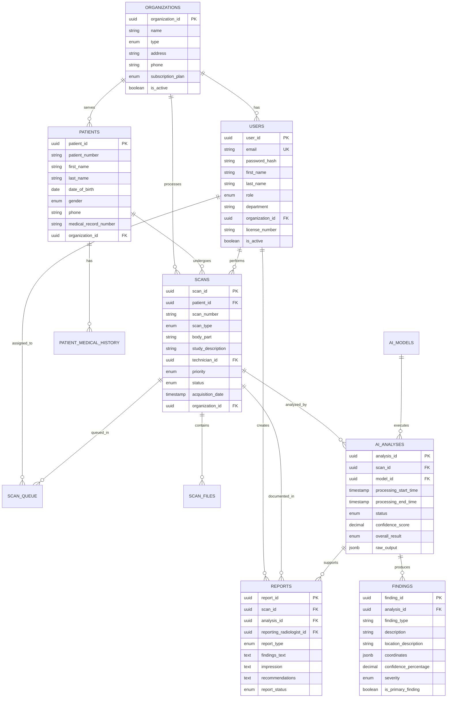

# Database Schema Summary

## Entity Relationship Overview



## Key Relationships

### 1. **Multi-Tenant Structure**
- Organizations contain Users, Patients, and Scans
- Data isolation by organization_id
- Supports multiple healthcare institutions

### 2. **Medical Workflow**
```
Patient → Scan → AI Analysis → Findings → Report
```

### 3. **Queue Management**
```
Scan → Queue Entry → Assigned User → Processing → Completion
```

### 4. **AI Processing Pipeline**
```
Scan Files → AI Model → Analysis Job → Findings → Clinical Review
```

## Table Categories

### 🏢 **Organization & Users**
- `organizations` - Healthcare institutions
- `users` - Medical professionals
- `user_sessions` - Authentication tracking
- `user_preferences` - User settings

### 👥 **Patient Care**
- `patients` - Patient demographics
- `patient_medical_history` - Medical background

### 🏥 **Medical Imaging**
- `scans` - Imaging studies
- `scan_files` - DICOM files
- `scan_queue` - Processing workflow

### 🤖 **AI & Analytics**
- `ai_models` - AI model versions
- `ai_analyses` - Processing jobs
- `findings` - Detected abnormalities

### 📋 **Clinical Documentation**
- `reports` - Radiologist interpretations
- `report_templates` - Standardized formats

### 📊 **System Operations**
- `system_metrics` - Performance data
- `audit_logs` - Compliance tracking
- `system_alerts` - Notifications
- `system_settings` - Configuration

### 🔗 **Integration**
- `external_integrations` - PACS/RIS connections
- `sync_logs` - Data synchronization
- `workflow_rules` - Automation rules

## Data Flow Examples

### Typical Scan Processing Flow
1. **Upload**: Scan created in `scans` table
2. **Queue**: Entry added to `scan_queue`
3. **Process**: AI analysis job in `ai_analyses`
4. **Detect**: Findings stored in `findings`
5. **Report**: Radiologist creates `reports`
6. **Audit**: All actions logged in `audit_logs`

### Performance Monitoring
1. **Metrics**: Real-time data in `system_metrics`
2. **Alerts**: Issues flagged in `system_alerts`
3. **Analytics**: Aggregated views for dashboards

### Integration Pipeline
1. **External**: Data received via `external_integrations`
2. **Sync**: Process logged in `sync_logs`
3. **Transform**: Data normalized to schema
4. **Store**: Records created in appropriate tables

## Indexing Strategy

### Primary Indexes
- All primary keys (UUID)
- Foreign key relationships
- Unique constraints (email, patient_number per org)

### Performance Indexes
- `scans(organization_id, status, priority)`
- `ai_analyses(scan_id, status)`
- `findings(analysis_id, severity)`
- `audit_logs(timestamp, user_id)`
- `system_metrics(metric_type, recorded_at)`

### Search Indexes
- `patients(medical_record_number)`
- `scans(scan_number, organization_id)`
- `users(email, organization_id)`

## Security Considerations

### Data Protection
- UUID primary keys prevent enumeration
- Password hashing with bcrypt
- Session management with tokens
- Audit trail for all changes

### HIPAA Compliance
- Patient data encryption at rest
- Access logging and monitoring
- Role-based permissions
- Data retention policies

### Multi-Tenancy
- Organization-based data isolation
- Cross-tenant access prevention
- Shared infrastructure security

## Scalability Features

### Performance
- Efficient indexing for large datasets
- Partitioning capability for time-series data
- Archive strategies for old records

### Growth
- Horizontal scaling support
- Read replicas for analytics
- Caching layer compatibility

### Monitoring
- Real-time metrics collection
- Performance bottleneck detection
- Capacity planning data